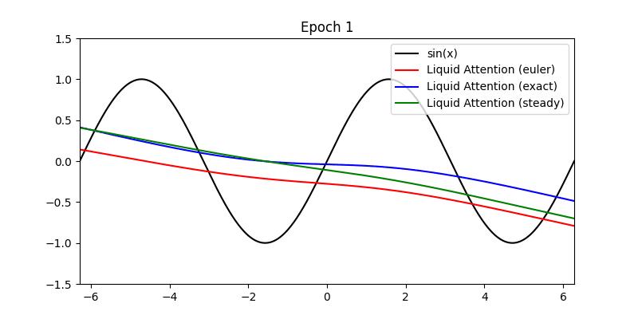

# Liquid Attention Network (LAN)
---
The repository contains the code of the Liquid Attention Network developed at the Networked Intelligent Control (NIC) Lab at the University of Science and Technology of China (USTC).


## LAN Model Usage Example

```python
import tensorflow as tf
from liquid_attention import LAN

# Create the model
inputs = tf.keras.Input(shape=(1, 1))
attn = LAN(
    d_model=64,
    num_heads=16,
    mode='exact, #steady or euler
    delta_t=0.1,
    euler_steps=10,
    activation='sigmoid',
    return_sequences=False,
    return_attention=False
)(inputs)
outputs = tf.keras.layers.Dense(1)(attn)
model = tf.keras.Model(inputs=inputs, outputs=outputs)

# Compile the model
model.compile(
    optimizer='adam',
    loss='mse',
    metrics=['mae']
)
```


## Experiments

### 1. Universal Approximation Verification

Demonstration and verification of LAN’s universal approximation capability.



---

### 2. Event-based MNIST

Training and evaluation on the event-based MNIST dataset.

* Code available in: `mnist_exp/`

```bash
python mnist_trainer.py
```

---

### 3. Person Activity Recognition (PAR)

Activity recognition experiment implementation.

* Code available in: `PAR_exp/`

```bash
python PAR_trainer.py
```

---

### 4. Lane Keeping for Autonomous Vehicles

**a) CarRacing (`CarRacing_exp/`)**

```bash
python drive.py
```
[Watch the demo on YouTube](https://youtu.be/PAclVXbzsms)


**b) Udacity Simulator (`Udacity_exp/`)**

1. Run the simulator in Autonomous mode.
2. Execute:

```bash
python drive.py model_weights/Udacity_LAN.keras
```
[Watch the demo on YouTube](https://youtu.be/tKfO55TwN0M)

---

### 5. Remaining Useful Life (RUL) Estimation

Dataset and code for RUL estimation experiments.

* Code and data available in: `RUL_exp/`

```bash
# Example: how to run
python rul_trainer.py
```


### 6. Seq2Seq Time-Series Imputation
Code for LAN imputation experiment.

* Code and data available in: `Impute_exp/`

```bash
# Example: how to run
python impute.py
```

---

## License

[Specify your license here, e.g., MIT License]
